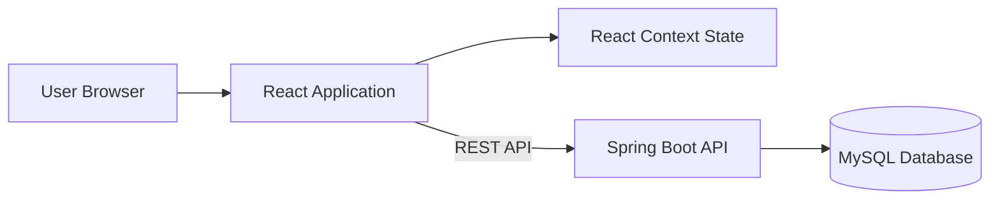
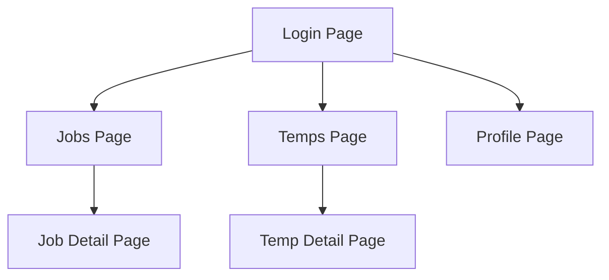
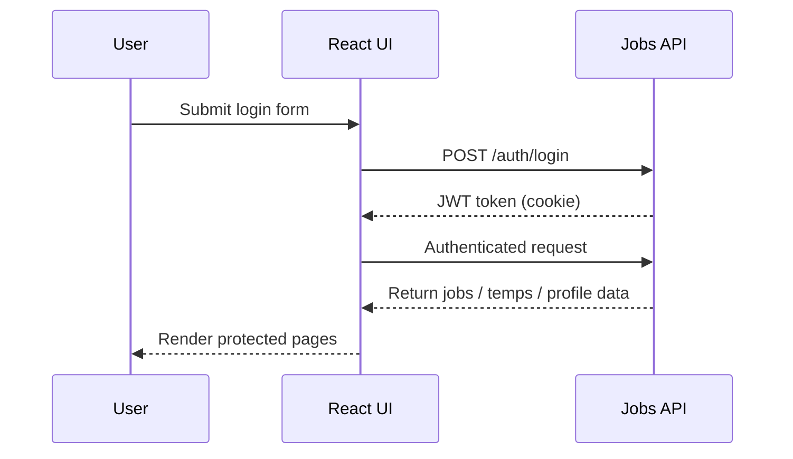

# Jobs UI

Frontend application for the Job Assignment System.

Built with React, TypeScript and Vite. The application allows users to log in, view jobs and temps within their hierarchy, update their profile, and assign temps to jobs through the backend API.

## Features

- Secure login
- Protected routes
- Profile management
- View temps in hierarchy
- View assigned and unassigned jobs
- Assign temps to jobs
- Pagination (jobs and temps)
- Sorting (jobs: date/name, temps: name/id/job count)
- Assignment confirmation popups
- Form validation using Zod
- API integration with JWT-based authentication

## Architecture

The React application communicates with the backend using REST endpoints.  
Authentication state is managed on the frontend and protected routes prevent unauthorised access.

## Tech Stack

React  
TypeScript  
Vite  
React Router  
Styled Components  
React Hook Form  
Zod Validation

## Project Structure

    src
    ├── api
    ├── components
    ├── pages
    ├── state
    ├── styles
    ├── App.tsx
    └── main.tsx

## Frontend Page Flow

## JWT Request Flow

## Routes

- `/login`
- `/profile`
- `/temps`
- `/temps/:id`
- `/jobs`
- `/jobs/:id`

All routes except `/login` require authentication.

## Running the Frontend

Install dependencies:

    npm install

Start the development server:

    npm run dev

Application runs at:

    http://localhost:5173

## Environment Variables

Create a `.env` file:

    VITE_API_BASE_URL=http://localhost:8080

## Example Login

- `admin@example.com / admin12345`

## What the UI Supports

- Login and authentication
- Viewing jobs visible to the logged-in user
- Viewing temps visible to the logged-in user
- Viewing detailed temp and job pages
- Assigning or unassigning temps from jobs
- Updating the current user profile